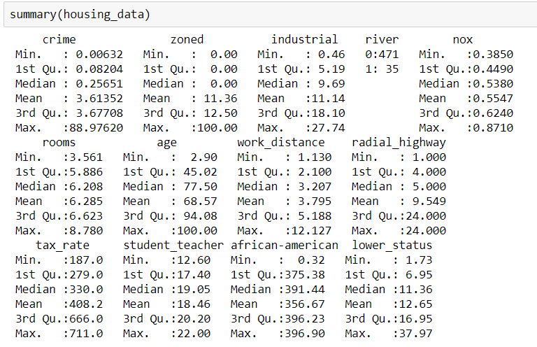

# CSX_450_2_Project_3

## Domain

This problem uses Boston housing data from StatLib library which is maintained at Carnegie Mellon University. It is a commonly used dataset and even comes pre-loaded in data science programming libraries (e.g. Python's SciKit-Learn and natively in R). The data was collected in 1978 by David Harrison Jr. and Daniel Rubinfeld for their paper "Hedonic housing prices and the demand for clean".

## Problem Statement

This data is normally used as in regression modeling because the target prediction is a continuous value, the median housing value. We will be using the data in the context of EDA.

## Dataset

The Boston housing dataset (available [here](https://archive.ics.uci.edu/ml/machine-learning-databases/housing/))

- Number of samples: 506 
- Number of attributes: 13
- Expected Dataframe Dimensions: 506 rows x 14 columns
- Column Data Types: 13 continuous values and 1 binary value
- Target: MEDV, continuous value

## Solution Statement

A solution to the problem is to apply a regression model such as linear model, additive model or regression tree. 

## Benchmark Model

For regression models, a good naive benchmark is to use the mean.

## Performance/Evaluation Metric

Given that this is a regression task, we can measure the accuracy of the model with the R2 score or MSE (mean square error). Our goal would be to aim for the best possible R2 score of 1.0 or MSE value of 0.0.

